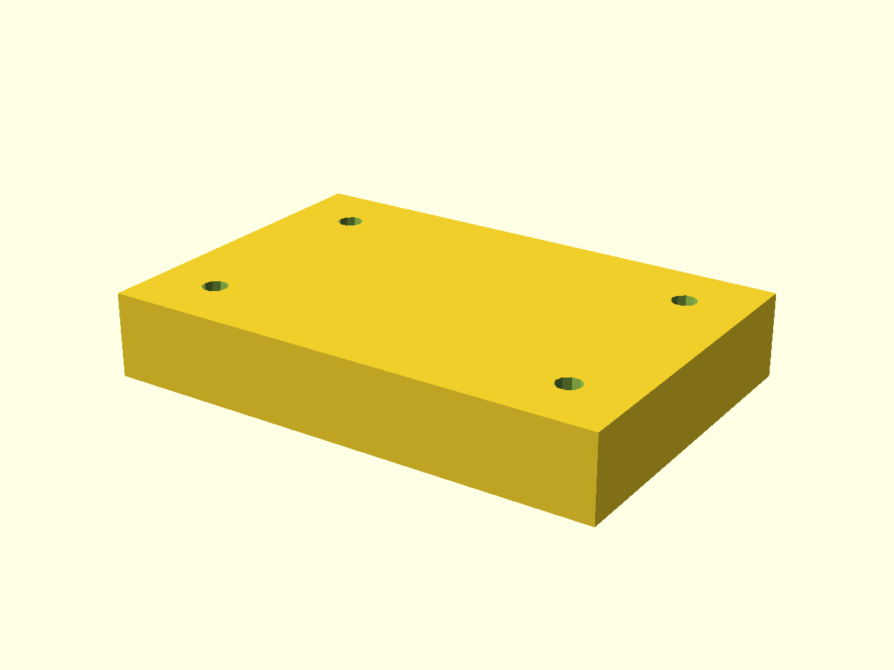

# sysmlcad

Parametric CAD shape modeling with pluggable backends — OpenSCAD, Build123d,
and more.

```python
from sysmlcad import Box, Cylinder, Parameter, export

length = Parameter("L", 100)
box = Box(length, 50, 30)
hole = Cylinder(30, 5)
part = box - hole

print(export(part, backend="openscad"))
```

### Flange — SysML v2 → PNG

Design a 120×80×20 plate with four bolt holes in SysML v2 and render to PNG
in one step:

```
// examples/flange.sysml
package Flange {
    part flange {
        attribute operator = "difference";
        part plate {
            attribute role = "positive";
            attribute length = 120.0 [mm];
            attribute width  = 80.0 [mm];
            attribute height = 20.0 [mm];
        }
        part hole1 { attribute role = "negative";
            attribute height = 20.0 [mm]; attribute radius = 3.0 [mm];
            attribute x = 15.0 [mm]; attribute y = 15.0 [mm]; }
        part hole2 { attribute role = "negative";
            attribute height = 20.0 [mm]; attribute radius = 3.0 [mm];
            attribute x = 105.0 [mm]; attribute y = 15.0 [mm]; }
        part hole3 { attribute role = "negative";
            attribute height = 20.0 [mm]; attribute radius = 3.0 [mm];
            attribute x = 15.0 [mm]; attribute y = 65.0 [mm]; }
        part hole4 { attribute role = "negative";
            attribute height = 20.0 [mm]; attribute radius = 3.0 [mm];
            attribute x = 105.0 [mm]; attribute y = 65.0 [mm]; }
    }
}
```



## Quick links

- **[TUTORIAL.md](TUTORIAL.md)** — step-by-step guide with examples
- `src/sysmlcad/ir.py` — Shape IR (all shape types)
- `src/sysmlcad/expression.py` — Symbolic parameter system
- `src/sysmlcad/openscad.py` — OpenSCAD backend
- `src/sysmlcad/build123d.py` — Build123d backend
- `tests/test_cad.py` — Test suite (run via `poetry run pytest`)

## Backends

| Backend | Key | Output | Requires |
|---------|-----|--------|----------|
| OpenSCAD | `"openscad"` | `.scad` | — |
| Build123d | `"build123d"` | `.py` | — |
| STL | `"stl"` | `.stl` | `openscad` CLI |
| STEP | `"step"` | `.step` | `build123d` |
| PNG | `"png"` | `.png` | `openscad` CLI |
| SVG | `"svg"` | `.svg` | `openscad` CLI |
